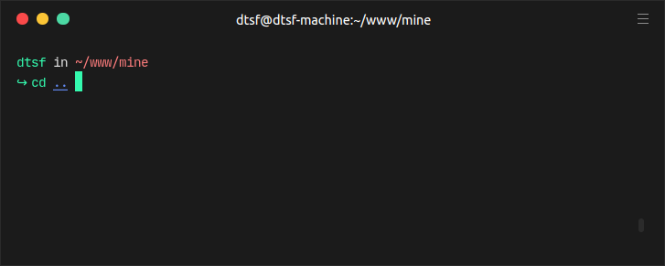

<h1 align="center">
Smooth Theme for Hyper
</h1>

  

# Installation

To install, simply modify your hyper.js config file putting `"hyper-smooth-theme"` in plugins list.

# Preview

#### **Screenshot**

  

#### **More**

The plugin that make the window buttons looks like mac is [hyper-custom-controls](https://www.npmjs.com/package/hyper-custom-controls).
